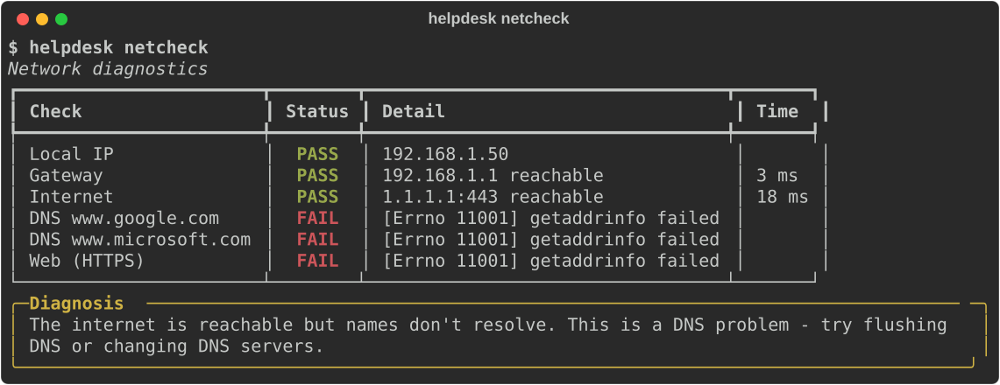
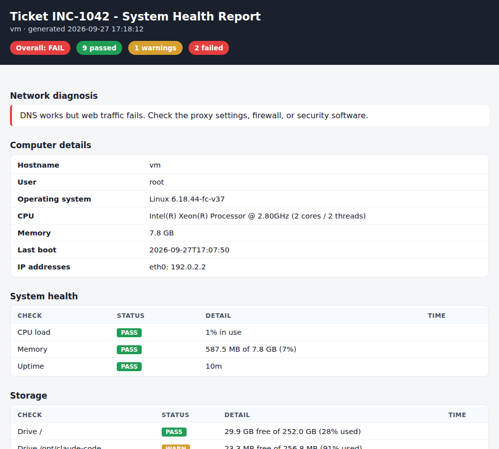

# 🛠️ Help Desk Toolkit

[](https://github.com/eguidey/helpdesk-toolkit/actions/workflows/ci.yml)


A cross-platform command-line toolkit that speeds up the most common IT help desk tickets:
**"my computer is slow"**, **"the internet is down"**, **"I'm out of disk space"**, and **"we have new hires starting Monday."**

Instead of clicking through five different Windows tools, a technician runs one command and gets a clear answer - or a full HTML report to attach to the ticket.

<p align="center">
  
</p>

---

## Features

| Command | What it does | Ticket it solves |
|---|---|---|
| `sysinfo` | Hostname, OS, CPU, RAM, uptime, battery, IPs + health checks | "What computer is this?" / "It's slow" |
| `netcheck` | Layered network test (adapter → gateway → internet → DNS → web) **with a plain-English root-cause diagnosis** | "The internet is down" |
| `diskcheck` | Drive usage with warning thresholds, plus the largest files and folders in any path | "I'm out of space" |
| `procs` | Top programs by CPU or memory | "My computer is slow" |
| `pwcheck` | Password policy check + breach lookup using **k-anonymity** (the password never leaves the machine) | Password resets / security awareness |
| `onboard` | Turns a new-hire CSV into usernames, emails and secure temporary passwords, avoiding duplicates | New-hire account setup |
| `report` | One self-contained HTML health report to attach to a ticket | Escalations & documentation |

## Example: HTML health report

`helpdesk report --ticket INC-1042` produces a single file you can attach to a ticket or email to a higher tier:

<p align="center">
  
</p>

---

## Installation

Requires **Python 3.10+**.

```bash
git clone https://github.com/eguidey/helpdesk-toolkit.git
cd helpdesk-toolkit
pip install -e .
```

This installs the `helpdesk` command. (You can also run it without installing: `pip install -r requirements.txt` then `python -m helpdesk_toolkit <command>`.)

## Usage

```bash
helpdesk sysinfo                    # computer specs + health checks
helpdesk sysinfo --json             # machine-readable output for scripts

helpdesk netcheck                   # is it the network?
helpdesk netcheck --host fileserver --host mail.company.com:443   # test specific servers

helpdesk diskcheck                  # usage for every drive
helpdesk diskcheck C:\Users\jdoe --top 15     # biggest files & folders in a profile

helpdesk procs --sort memory        # memory hogs

helpdesk pwcheck                    # prompts securely - input is hidden

helpdesk onboard sample_data/new_hires.csv --domain contoso.com \
    --existing sample_data/existing_users.txt -o new_accounts.csv

helpdesk report --ticket INC-1042   # full HTML report
```

### Exit codes

Every check command returns **0** (all good), **1** (warnings) or **2** (failures), so the toolkit can be used in scripts, scheduled tasks or monitoring:

```powershell
helpdesk diskcheck; if ($LASTEXITCODE -ge 2) { Write-Warning "Disk space critical" }
```

---

## How it works

### Network diagnosis logic
`netcheck` tests each network layer in order and reports the **first** layer that breaks, because everything after it will fail too:

1. **Local IP** - no address means the adapter is down; a `169.254.x.x` address means DHCP failed.
2. **Gateway** - finds the default gateway from the OS routing table (`route print` / `ip route` / `route get`).
3. **Internet** - opens a TCP connection to `1.1.1.1:443` (works even where ping is blocked).
4. **DNS** - resolves well-known names. Internet up + DNS down → classic DNS issue.
5. **Web** - fetches an HTTPS URL. DNS up + web down → proxy, firewall or security software.

Gateway problems are only blamed when the internet is actually unreachable, so VPNs and unusual routing don't cause false alarms.

### Privacy-safe breach check
`pwcheck` uses the [Have I Been Pwned](https://haveibeenpwned.com/API/v3#PwnedPasswords) range API. The password is hashed locally with SHA-1 and **only the first 5 characters of the hash** are sent. The API returns every matching hash suffix and the comparison happens locally - so neither the password nor its full hash ever leaves the computer. A unit test verifies this.

### Secure temporary passwords
`onboard` uses Python's `secrets` module (cryptographically secure), guarantees every character type, and leaves out look-alike characters (`0/O`, `1/l/I`) so passwords can be read over the phone without mistakes. Usernames follow the common *first initial + last name* convention, strip accents and punctuation (`José O'Brien` → `jobrien`), and add numbers for duplicates (`jsmith`, `jsmith2`).

---

## Project structure

```
helpdesk_toolkit/
├── cli.py          # argparse commands + rich terminal output
├── sysinfo.py      # hardware / OS / resource collection (psutil)
├── netcheck.py     # layered network tests + root-cause diagnosis
├── diskcheck.py    # drive usage + heap-based largest-file search
├── procs.py        # CPU / memory process ranking
├── pwcheck.py      # password policy + k-anonymity breach lookup
├── onboard.py      # new-hire CSV → accounts
├── report.py       # self-contained HTML report
└── utils.py        # shared status types and formatting
tests/              # pytest suite (68 tests)
sample_data/        # example CSV for the onboard command
```

## Development

```bash
pip install -r requirements.txt -r requirements-dev.txt
pytest -v          # run the tests
ruff check .       # lint (includes security rules)
```

GitHub Actions runs the linter and full test suite on **Windows, macOS and Linux** for every push.

## Roadmap

- [ ] `printers` - list printers and clear stuck print queues
- [ ] `wifi` - signal strength and saved-network details
- [ ] Active Directory integration for `onboard` (create accounts directly via LDAP)
- [ ] Export reports to PDF

## License

MIT - see [LICENSE](LICENSE).

---

Built by **Ian Guidry** · [ianguidry.com](https://ianguidry.com) · [LinkedIn](https://www.linkedin.com/in/ian-guidry-5823ab25b/)
